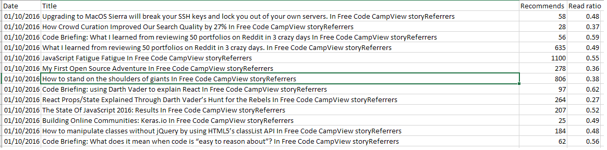

# Who am I and what am I doing here?

--

- Cardiff University 2014 (Psychology)

--

- 2nd year research assistancy
   - An investigation into the efficacy of publication bias correction methods

--

Me:
.center[]

---

# Summary

--

- A brief history

--

- What is R?

--

- R vs. other languages

--

- Using R (including an example)

--

- Q & A

---

# A brief history

- Fortran

--

   - Developed by IBM in the 1950s

--

   - Suited to numeric computation and scientific computing
   - Became the basis for many other programming languages like BASIC

--

- S (1976)

--

   - John Chambers

--

   - "...designed to offer an alternative and more interactive approach [to Fortran]"

--

   - Originally called Fortran to do most of the computing, but many of the internal functions were rewritten using C in 1988

--

- R (1995)

--

   - Ross Ihaka & Robert Gentleman

--

   - "R can be considered as a different implementation of S"

--

   - Relies internally on C, Fortran and R

---

# What is R?


--

- Statistical programming language

--

- 9th most popular programming language ([TIOBE index](https://en.wikipedia.org/wiki/TIOBE_index]))

--

- Open-source

--

- Functional programming language

--

   - Object-oriented systems

--

- Interpreted language
   - R needs to be installed to run R code
   
--

   - But there's growing support for web apps...

--

- Supported with over 15,000 open-source packages (written primarily in R, but also Java, C, C++, and Fortran)

--

   - Provided through the Comprehensive R Archive Network ([CRAN](https://cran.r-project.org/))


---

# R vs. other languages

--

- Functional vs. Object-oriented

--

> Object oriented:

```{r, eval = FALSE}
new_person = person("Adam", "Rawles")
new_person.print()
```

```{r, echo = FALSE}
print(c("Adam", "Rawles"))
```

--

> Functional:

```{r, eval = FALSE}
new_person <- person("Adam", "Rawles")
print(new_person)
```

```{r, echo = FALSE}
print(c("Adam", "Rawles"))
```

--

- Designed for data analysis, not really software development

--

- Human-readable syntax

---


# Using R

--

- What can you use R for?

--

   - Reporting
   - Data analysis
   - Statistics and machine learning
   - Data driven web apps
   - Presentations

--

- How do you code in R?

--

   - R GUI
   - RStudio
   - Visual Studio Code

---

#  What does R code look like?

--

```{r}
1 + 1
```

```{r}

v1 <- "hello"
v2 <- "world"
cat(v1, v2)

```

--

- But let's look at a proper example...

---

# Example

- [CodeCamp](https://www.freecodecamp.org/) dataset containing tutorials and some stats

--

.center[
```{r, echo = FALSE, out.width="80%"}

```
]

--

- We're going to use the [Tidyverse](www.tidyverse.org) packages to load and analyse the data   

--

   - Load
   - Clean
   - Summarise
   - Plot


---

# Loading the data


--

```{r}
cc_data <- readr::read_csv("code_camp_data.csv")
print(cc_data,n = 3, width = 75)
```

---

# Cleaning the data

--

```{r}
library(dplyr, warn.conflicts = FALSE)
library(stringr)
cc_data <- cc_data %>%
   mutate(Date = as.Date(Date, format = "%d/%m/%Y"),
          topic = case_when(
             str_detect(Title,
                        pattern = "Javascript|CSS|jQuery|React|Node.js|HTML"
             ) ~ "Web software",
             str_detect(Title,
                        pattern = "Mac|Windows|Linux") ~"Operating systems",
             TRUE ~ "Other"
          ))
print(cc_data, n = 2, width = 75)

```


---

# Summarising the data 

--

```{r}

summarised_cc_data <- cc_data %>%
   dplyr::group_by(Date, topic) %>%
   dplyr::summarise(average_read_ratio = mean(`Read ratio`)) %>%
   dplyr::ungroup()

print(summarised_cc_data, n = 10)
```

---

# Plotting the data

--
```{r, fig.width=7, fig.height=5, out.extra = "style = 'margin-left:auto;margin-right:auto;display:block;'"}
library(ggplot2)
ggplot(summarised_cc_data, aes(x = Date, y = average_read_ratio, color = topic)) +
   geom_line(size = 1.25) +
   scale_x_date(name = "Date", date_labels = "%b %y") +
   scale_y_continuous(name = "Average Read Ratio") +
   scale_color_discrete(name = "Topic") +
   theme_classic()
```

---
.center[
```{r, echo = FALSE, out.width="80%"}
knitr::include_graphics("resources/plug.svg")
```
]
---

# teacheR

- Aimed at those who are new to data analysis or who are looking to start teaching others

--

- Two sections: For Students, For Teachers

--

- Hosted for free at [teacher.arawles.co.uk](https://teacher.arawles.co.uk), including a PDF and Ebook version.

--

- Paperback copies to come soon (but very limited)

--

- Hopefully to be followed by another book ([opeRate](https://operate.arawles.co.uk))

---

# Introduction to R Course

--

- Month-long introduction course

--

- Every Thursday in November here the Digital Greenhouse (6-7pm)

--

- Absolutely free, but limited spaces!


---

class: center, middle

# Thanks! Any questions?

Slides created via the R package [**xaringan**](https://github.com/yihui/xaringan).

